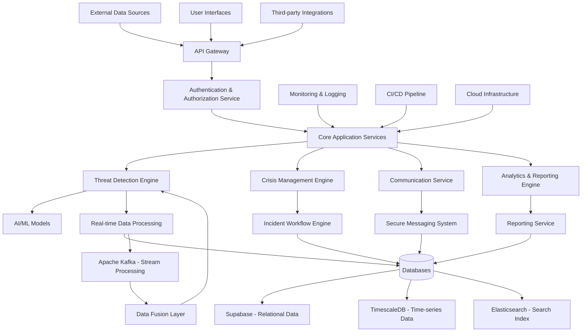

# CivicShield Architecture

This document provides an overview of the CivicShield platform architecture.

## Table of Contents

- [High-Level Architecture](#high-level-architecture)
- [Component Diagram](#component-diagram)
- [Data Flow](#data-flow)
- [Technology Stack](#technology-stack)
- [Security Architecture](#security-architecture)
- [Scalability](#scalability)
- [High Availability](#high-availability)

## High-Level Architecture

CivicShield follows a microservices architecture with the following key components:

## Component Diagram

### Core Services

1. **Authentication & Authorization Service**
   - User authentication and session management
   - Role-based access control
   - Multi-factor authentication

2. **Threat Detection Engine**
   - Multi-source data fusion
   - AI/ML-based threat analysis
   - Real-time threat scoring

3. **Crisis Management Engine**
   - Incident tracking and management
   - Resource allocation
   - Response workflow automation

4. **Communication Service**
   - Secure messaging between agencies
   - Notification system
   - Broadcast capabilities

5. **Analytics & Reporting Engine**
   - Data analysis and visualization
   - Report generation
   - Trend identification

### Supporting Services

1. **Data Processing Pipeline**
   - Apache Kafka for stream processing
   - Real-time data transformation
   - Batch processing for analytics

2. **AI/ML Services**
   - Natural Language Processing (NLP)
   - Pattern recognition
   - Anomaly detection
   - Predictive analytics

3. **Database Services**
   - Supabase for relational data
   - TimescaleDB for time-series data
   - Elasticsearch for search and analytics

4. **Infrastructure Services**
   - Container orchestration (Kubernetes)
   - Load balancing
   - Auto-scaling
   - Monitoring and logging

## Data Flow

### Data Ingestion

1. **Social Media Feeds**
   - Twitter, Facebook, Instagram APIs
   - Real-time streaming data
   - Sentiment analysis

2. **IoT Sensors**
   - Camera feeds
   - Motion sensors
   - Environmental sensors
   - Real-time data streaming

3. **Satellite Feeds**
   - Imagery data
   - Telemetry data
   - Geospatial analysis

4. **Emergency Calls**
   - 911 call data
   - Location data
   - Audio transcription

5. **Intelligence Reports**
   - Structured reports
   - Unstructured intelligence data
   - Human intelligence (HUMINT)

### Data Processing

1. **Data Normalization**
   - Format standardization
   - Geospatial tagging
   - Temporal alignment

2. **Data Storage**
   - Relational data in Supabase
   - Time-series data in TimescaleDB
   - Search index in Elasticsearch

3. **Threat Analysis**
   - NLP processing
   - Pattern recognition
   - Anomaly detection
   - Threat scoring

### Data Output

1. **Real-time Alerts**
   - Push notifications
   - SMS alerts
   - Email notifications
   - Dashboard alerts

2. **Incident Management**
   - Incident creation
   - Resource allocation
   - Response coordination

3. **Analytics and Reporting**
   - Trend analysis
   - Compliance reporting
   - After-action reports

## Technology Stack

### Backend

- **Primary Language**: Python
- **Web Framework**: FastAPI
- **Database**: 
  - Supabase (PostgreSQL)
  - TimescaleDB
  - Elasticsearch
- **Real-time Processing**: Apache Kafka
- **AI/ML**: PyTorch, TensorFlow, Hugging Face Transformers
- **Caching**: Redis
- **Authentication**: OAuth 2.0, JWT

### Frontend

- **Framework**: Next.js (React)
- **UI Components**: Chakra UI
- **Mapping**: Mapbox GL JS
- **Charts**: Chart.js
- **State Management**: React Context API

### Infrastructure

- **Containerization**: Docker
- **Orchestration**: Kubernetes
- **Cloud Providers**: AWS, Azure, GCP
- **CI/CD**: GitHub Actions
- **Monitoring**: Prometheus, Grafana, ELK Stack

### Security

- **Encryption**: TLS 1.3, AES-256
- **Authentication**: OAuth 2.0, OpenID Connect
- **Authorization**: Role-Based Access Control (RBAC)
- **Key Management**: HashiCorp Vault

## Security Architecture

### Identity and Access Management

- **Single Sign-On (SSO)**: Integration with government identity providers
- **Multi-Factor Authentication (MFA)**: Time-based one-time passwords
- **Role-Based Access Control (RBAC)**: Predefined roles with specific permissions
- **Attribute-Based Access Control (ABAC)**: Dynamic access based on user attributes

### Data Protection

- **Encryption at Rest**: AES-256 for all stored data
- **Encryption in Transit**: TLS 1.3 for all network communications
- **Client-Side Encryption**: For highly sensitive data
- **Key Management**: Hardware Security Modules (HSMs)

### Network Security

- **Firewalls**: Next-generation firewalls with deep packet inspection
- **Intrusion Detection**: Network and host-based intrusion detection systems
- **Web Application Firewall (WAF)**: Protection against application-layer attacks
- **DDoS Protection**: Mitigation of distributed denial-of-service attacks

### Application Security

- **Secure Coding**: Implementation of OWASP Secure Coding Practices
- **Static Analysis**: Automated code analysis for security vulnerabilities
- **Dynamic Analysis**: Runtime security testing
- **Dependency Scanning**: Vulnerability assessment of third-party components

## Scalability

### Horizontal Scaling

- **Microservices Architecture**: Independent scaling of services
- **Container Orchestration**: Kubernetes for container management
- **Load Balancing**: Automatic distribution of traffic
- **Auto-scaling**: Dynamic adjustment of resources based on demand

### Vertical Scaling

- **Database Sharding**: Distribution of data across multiple database instances
- **Caching**: Redis for frequently accessed data
- **Content Delivery Network (CDN)**: Global distribution of static assets
- **Database Optimization**: Indexing and query optimization

### Performance Optimization

- **Database Connection Pooling**: Efficient database connection management
- **Query Optimization**: Optimized database queries
- **Caching Strategies**: Multi-level caching for improved performance
- **Asynchronous Processing**: Non-blocking operations for better responsiveness

## High Availability

### Redundancy

- **Multi-zone Deployment**: Deployment across multiple availability zones
- **Database Replication**: Master-slave replication for databases
- **Load Balancer Redundancy**: Multiple load balancers for failover
- **Service Redundancy**: Multiple instances of critical services

### Disaster Recovery

- **Backup Strategy**: Regular automated backups
- **Data Replication**: Cross-region data replication
- **Failover Mechanisms**: Automatic failover to backup systems
- **Recovery Procedures**: Documented recovery procedures

### Monitoring and Alerting

- **Health Checks**: Continuous monitoring of service health
- **Performance Metrics**: Real-time performance monitoring
- **Alerting System**: Automated alerting for system issues
- **Log Aggregation**: Centralized log management

## Contact

For architecture-related questions, please contact the CivicShield Architecture Team at architecture@civicshield.example.com.